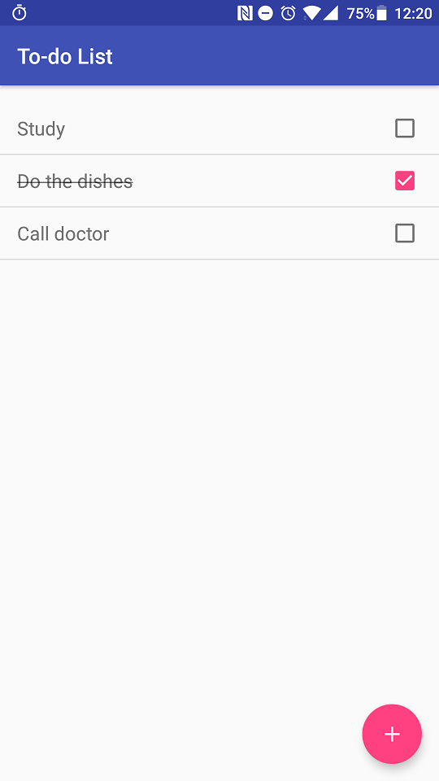
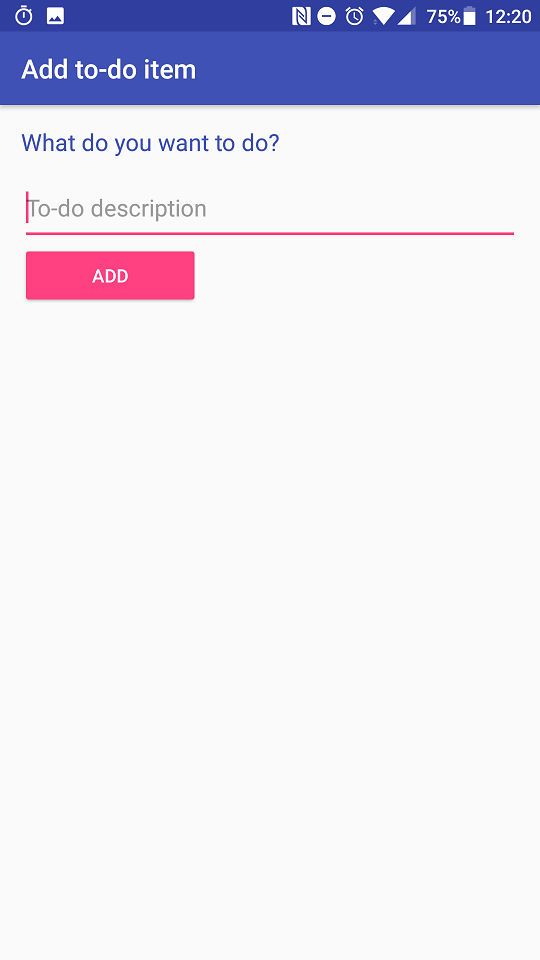
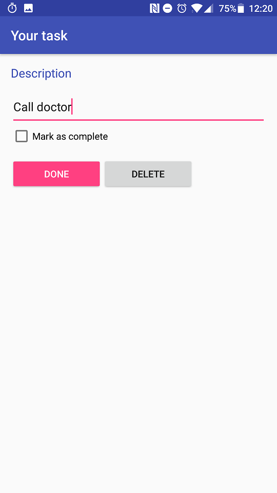

# To-do List

Native App Studio - Project 4

By Sebastiaan Joustra

A simple app that allows the user to add tasks to a to-do list. Then they can mark a task as complete, remove it, or edit it.

## How to run

Open in Android Studio and run on a Android device with 7.0 or higher.

### Screenshots

